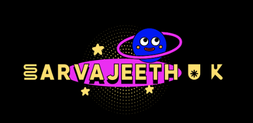

----
* I'm Sarvajeeth, a passionate developer and researcher @IIIT-Delhi'25.

* My research interests are Machine Learning, Data Science, and Backend Development.
  
* Most of my learnings come from hands-on projects and university courses.

* Tags: Problem solver, innovative thinker, tech enthusiast.

----

 

  

## About Me

I'm a final-year Bachelor of Technology student at Indraprastha Institute of Information Technology, Delhi, specializing in Computer Science and Software Systems. I have a strong foundation in backend development, data science, and machine learning.

## Technical Skills

### Programming Languages
- Python
- Java
- Kotlin

### Backend Development
- Django
- Flask
- REST API
- SpringBoot
- MongoDB
- MySQL
- Docker
- Git

### Data Science & Machine Learning
- Pandas
- NumPy
- TensorFlow
- Keras
- scikit-learn
- OpenCV
- LSTM

## Experience

### Research Intern - Complex Systems Lab, IIIT Delhi (Aug 2023 - Present)
- Machine Learning for Computational Gastronomy
- Built ML models for allergen detection in a Protein Sequence
- Engineered a recipe recommendation system using collaborative filtering, deployed via Flask

### Data Science Intern - Excelsoft Technologies Pvt Ltd (May 2024 - Jul 2024)
- Data Science & Data Analyzation
- Built predictive models for user engagement analysis using TF-IDF and cosine similarity
- Performed data cleaning and exploratory analysis to optimize content personalization accuracy

### Developer Intern - Caliper Business Solutions (May 2023 - Jul 2023)
- Backend Development & API Integration
- Automated SMS alerts for adverse weather using Twilio API, reducing logistics delays by 30%
- Designed geo-fencing system with Django, improving truck route compliance by 25%

## Projects

### SafeChoice - Personalized Product Safety Checker (Mar 2024 - Present)
- Built a Streamlit app that scans product barcodes and checks safety based on user allergies/health conditions
- Integrated OpenFoodFacts API to retrieve product details and analyze ingredients against user profiles
- Created intuitive interface with clear safety indicators and detailed ingredient breakdowns
- Implemented user authentication and profile management system for personalized recommendations
- Tech: Python, Streamlit, OpenFoodFacts API, Pandas, SQLite

### MedEase (Dec 2024)
- Built a machine learning model to predict hospital readmissions using FHIR API for data integration
- Implemented an OpenAI summary generator to provide concise and actionable insights from patient data
- Tech: Python, Jupyter Notebook, Machine Learning, FHIR API, OpenAI API

### ML Allergen Model (Jan 2024 - May 2024)
- Developed a machine learning pipeline for allergen classification with TensorFlow and scikit-learn
- Improved prediction accuracy through feature selection, data augmentation, and hyperparameter tuning
- Technologies: Python, TensorFlow, scikit-learn

### Traffic Terminator - Namma Yatri Peak Hour Solution (Jan 2024 - Oct 2024)
- Developed AI-driven solution to optimize taxi supply-demand balance during peak hours in Bengaluru
- Implemented hotspot prediction using LSTM Neural Networks and created dynamic pricing system using Q-Learning Reinforcement Learning model
- Developed intelligent ride matching algorithm and queue management system for efficient ride distribution
- Implemented WhatsApp integration for accessibility and subscription-based model (Namma Yatri Plus) with priority access
- Created loyalty queue system based on ride history and experience-based incentives for drivers to increase engagement and retention
- Built comprehensive dashboard for monitoring hotspots, dynamic pricing, ride sharing benefits, and driver recommendations
- Tech: Python, Machine Learning, Reinforcement Learning, NLP, Geospatial Analysis

### Course ChatBot & Suggester (Nov 2024 - Jan 2025)
- Built a chatbot using NLP and FAISS for university course regulation queries
- Extracted and indexed PDFs for fast and accurate responses
- Tech: Python, Flask, FAISS, NLP

### Moodipy: Emotion-Based Music Player (Aug 2024 - Nov 2024)
- Integrated emotion detection with Spotify API for real-time music recommendations
- Used a deep learning model to classify emotions from facial expressions
- Tech: Python, Flask, TensorFlow, Spotify API

### WeatherApp (June 2024 - Aug 2024)
- Developed an Android app for real-time and predictive weather data
- Technologies Used: Kotlin, OpenWeather API, Android Studio

## Education

### Indraprastha Institute of Information Technology, Delhi
Bachelor of Technology in CSSS (8th Semester) - Dec 2021 – Present

### BGS PU College, Mysuru
Percentage: 96.6% - Karnataka Board of Secondary School - 2019 – 2021

### St. Joseph’s Central School, Mysuru
Percentage: 95.6% - Secondary School Certificate (CBSE) - 2009 – 2019

## Awards and Achievements

- Dean's Award for Academic Excellence: Received in my 3rd Year at IIITD.
- Finalist, The Great Bengaluru Hackathon : Placed in the top 9 out of 150+ teams in this prominent innovation event.
- 2nd Place - Enactus Hackathon: Recognized for innovative project development.
- Competitive Programming: Solved 500+ problems on LeetCode, emphasizing expertise in Data Structures and Algorithms.

## Interests and Hobbies

- Extra Activities: Chess, Trekking, and exploring nature.
- Project Development: Passionate about building innovative software projects and experimenting with new technologies.
- Music : Enjoy listening to tech podcasts and music while coding.
